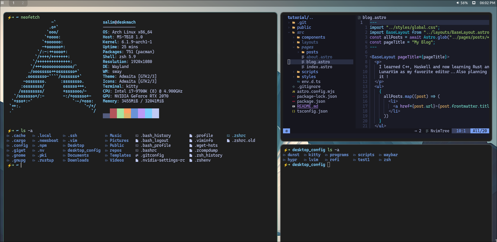

# Desktop Config



## Installing

You will need `git` and GNU `stow`

Clone into your `$HOME` directory or `~`

```bash
git clone https://github.com/salimp2009/deskmach_config.git ~
```

Run `stow` to symlink everything or just select what you want

```bash
stow */ # Everything (the '/' ignores the README)
```

```bash
stow zsh # Just my zsh config
```

## Programs

An list of all the programs I have is included in the `programs` directory

Thanks to [Christian Chiarulli](https://github.com/ChristianChiarulli) for inspiring,
his videos, awesome discord community, zap (best zsh plugin),scripts and LunarVim.
